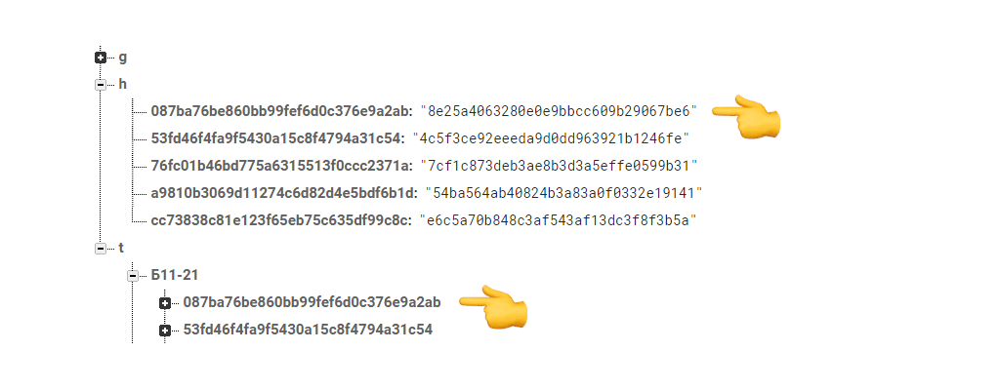
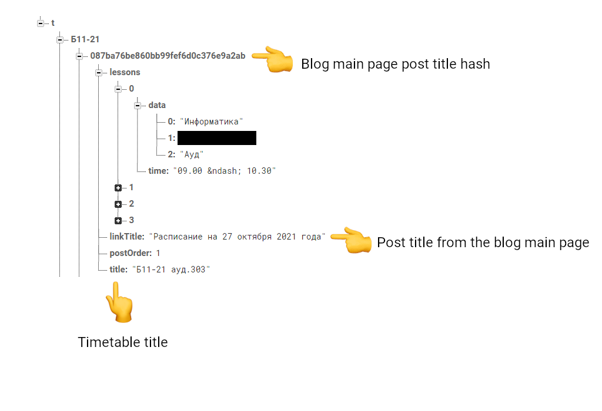

# Sufflain's server-side application
*This script tracks timetables changes on the site of my college and stores them in a database.
The data is accessed through the web app.*

Licensed under the **GNU AGPLv3**. For more, read the [LICENSE](./LICENSE) file.

Images are licensed under the **Creative Commons Attribution-NonCommercial-NoDerivatives 4**. For more, read the [LICENSE](./img/LICENSE.md) file.

## Docker container demo
*The iteration is quick because there are no timetable changes.*
[](https://asciinema.org/a/tNy9FCfLo4vUDBpaG9Poyv331?speed=1.5)

### Explanation
The computed hashes are equal to those stored in the database.
That means the data didn't change.
The app will wait for the next iteration.

## How does it work?
1. Every *[specified time]* minutes the app gets the blog page from the college site.
2. For every blog post title, a hash is computed.
3. For every blog post timetable, a hash is computed.
4. After that, depending on the situation, the app will either add, update, or remove from the database a timetable with its hashes.

### Hashes - the key component
We use them to find out if there are any changes or not.

**The timetable for each date can be accessed by its hash, as shown in the figure below:**



### Timetable info structure
**The structure is similar for each group.**



## Project configuration
###
You will need a CouchDB database with a configured admin user.

### Docker
1. Create a directory called *private* in the project root directory.
2. Copy the program's config file from the [template](./template) directory to *private*.

### Standard
1. Copy the program's config file from the [template](./template) directory to *$HOME/.config*.

*In both cases, you need to fill the config file with your own data.*

## Build
### Docker
```bash
make docker
```

Issuing this command results in building a docker image tagged as "*sufflain-server*."

### Standard
1. Run a script for resolving dependencies. Use either a PowerShell or shell script, depending on your system:
```powershell
.\resolve-deps.ps1
```
*or*
```sh
./resolve-deps.sh
```
2. Use GNU Make to test and build the app itself:
```sh
make
```

## Usage
1. Get groups from a specific timetable:
```bash
sfl --get-groups [specific timetable url]
```
or
```bash
sfl -g [specific timetable url]
```

The command above will extract groups from the page and add them to the database.

2. Get teachers' names from a file and upload them to the DB.

*The file must contain a valid Racket list of strings:*
`'("Teacher1's name" "Teacher2's name")`, for example.

```bash
sfl -n [file path]
```
or
```bash
sfl --read-names [file path]
```

3. Run the app:
```bash
sfl --track
```
or
```bash
sfl -t
```

## Commit Message Guidelines
We use [Conventional Commits](https://www.conventionalcommits.org/en/v1.0.0/) to format our commit
messages.

## Libraries
- [sxml](https://pkgs.racket-lang.org/package/sxml) - Copyright info is not provided.
- [html-parsing](https://pkgs.racket-lang.org/package/html-parsing) - Copyright 2003–2012, 2015, 2016, 2018 Neil Van Dyke
- [mock](https://pkgs.racket-lang.org/package/mock) - Copyright (c) 2016 Jack Firth
- [while-loop](https://pkgs.racket-lang.org/package/while-loop) - Copyright info is not provided.
- [percs](https://gitlab.com/crt0r/percs.git) - Copyright (c) 2022 Timofey Chuchkanov